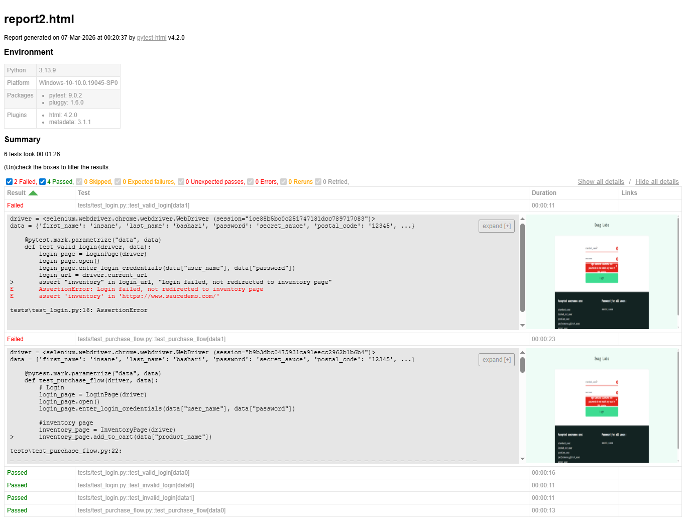

# Python Saucedemo Selenium Test Automation

## Description

A Selenium WebDriver test automation framework built with Python and pytest, implementing the Page Object Model pattern to automate end-to-end test scenarios for the SauceDemo web application.

## Tech stack

- python
- pytest
- Selenium
- Jenkins
- webdriver-manager.

## Project structure

saucedemo-automation/
│
├── pages/
│ ├── login_page.py
│ ├── inventory_page.py
│ ├── cart_page.py
│ └── checkout_page.py
│
├── tests/
│ ├── conftest.py
│ ├── test_login.py
│ ├── test_purchase_flow.py
│
│
├── reports/
├── requirements.txt
└── README.md

## How to install

Write on your terminal: pip install -r requirements.txt

## How to run tests

Run all test cases: "pytest -v -s"  
Run a specific tests: "pytest tests/file_name -v -s"

## How to generate HTML report

"pytest -v --html=reports/report.html --self-contained-html" to generate the html report inside the reports folder

